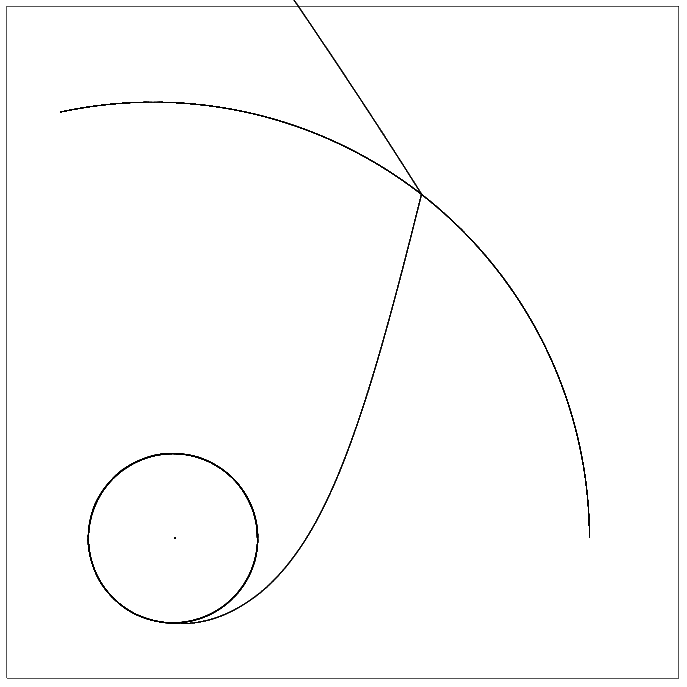

# BenchMark

This is a set of directories (c cpp fortran java perl python)

Each implements a Runge-Kutta numerical integrator, and solves
24 coupled first order diferential equations. This is a Newtonian
four body problem.

To build all of these type 'make' in the top level directory.

In any sub directory type 'make test' to get the post script output.

To just see the timings you can type 'make bench' from this directory.

The graphic shows the Earth and Moon orbiting the Sun.
At a point in the future energy is added to the moon
creating a large highly eccentric orbit. As it passes Jupiter
it robs momentum (sling-shot) from the gas giant and achieves solar
escape velocity.

I call this an "homage to Space 1999"

